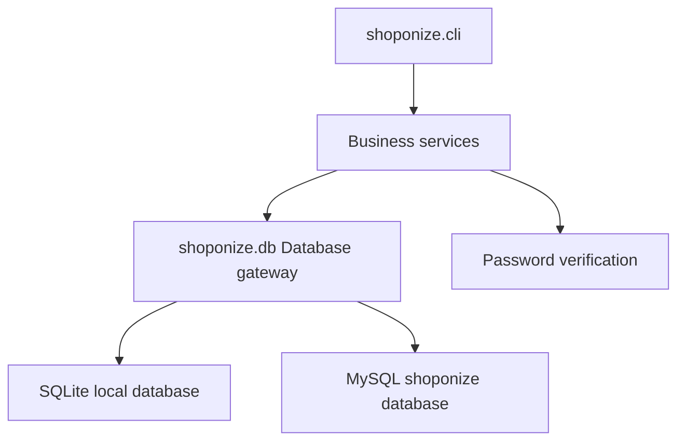

# Shoponize Online Bookstore Management System

Shoponize is a command-line bookstore management system for customers and administrators. The original repository was a single MySQL script plus one monolithic Python file; it has been upgraded into a small, testable Python application with a service layer, configurable database access, local SQLite support, MySQL support, automated tests, and production-grade setup documentation.

## What The App Does

| Area | Capabilities |
| --- | --- |
| Customer authentication | Login, failed-attempt tracking, account lockout, legacy plaintext password compatibility, hashed password verification support |
| Catalog browsing | Search products by name or description, browse categories, inspect product details |
| Cart | Add items, accumulate quantities safely, prevent overselling, remove items, view totals |
| Checkout | Create orders, write order line items, decrement inventory, mark low stock, clear cart atomically |
| Administration | View orders, update order status, delete orders, inspect low stock, update product prices, unlock customer accounts |
| Database | SQLite for zero-friction local use and tests, MySQL for production-like deployments |

## Repository Layout

```text
.
├── connect.py                  # Backwards-compatible launcher
├── Shoponize.sql               # MySQL schema and seed data
├── README.md                   # Project guide
├── requirements.txt            # Runtime dependency for MySQL mode
├── requirements-dev.txt        # Test/development dependencies
├── shoponize/
│   ├── cli.py                  # Interactive terminal UI
│   ├── config.py               # Environment-driven configuration
│   ├── db.py                   # SQLite/MySQL DB-API gateway
│   ├── schema.py               # SQLite schema and seed data
│   ├── security.py             # Password hashing and verification
│   └── services.py             # Auth, catalog, cart, checkout, admin logic
└── tests/
    └── test_services.py        # Unit tests for critical business flows
```

## Architecture



The CLI handles only input/output. Business rules live in `shoponize/services.py`, so checkout, auth, and admin behavior can be tested without driving terminal prompts. Database access is centralized in `shoponize/db.py`, which keeps connection cleanup, transactions, rollback, and placeholder translation out of the business logic.

## Requirements

| Tool | Version |
| --- | --- |
| Python | 3.9 or newer |
| SQLite | Built into Python |
| MySQL | Optional, only required for `SHOPONIZE_DB_BACKEND=mysql` |

## Quick Start With SQLite

SQLite is the default backend and needs no external server.

```bash
python3 connect.py
```

On first run, the app creates `shoponize.db` and seeds sample users/products.

Sample credentials:

| Role | Username | Password |
| --- | --- | --- |
| Customer | `john_doe` | `password123` |
| Customer | `emily_j` | `securepass` |
| Admin | `admin1` | `adminpass` |

## MySQL Setup

Install the runtime dependency:

```bash
python3 -m pip install -r requirements.txt
```

Create and seed the MySQL database:

```bash
mysql -u root -p < Shoponize.sql
```

Run the app against MySQL:

```bash
export SHOPONIZE_DB_BACKEND=mysql
export SHOPONIZE_DB_HOST=127.0.0.1
export SHOPONIZE_DB_PORT=3306
export SHOPONIZE_DB_USER=root
export SHOPONIZE_DB_PASSWORD='your-password'
export SHOPONIZE_DB_NAME=shoponize
python3 connect.py
```

## Configuration

| Variable | Default | Description |
| --- | --- | --- |
| `SHOPONIZE_DB_BACKEND` | `sqlite` | `sqlite` or `mysql` |
| `SHOPONIZE_SQLITE_PATH` | `shoponize.db` | SQLite database file path |
| `SHOPONIZE_DB_HOST` | `127.0.0.1` | MySQL host |
| `SHOPONIZE_DB_PORT` | `3306` | MySQL port |
| `SHOPONIZE_DB_USER` | `root` | MySQL user |
| `SHOPONIZE_DB_PASSWORD` | empty | MySQL password |
| `SHOPONIZE_DB_NAME` | `shoponize` | MySQL database name |

Credentials are no longer hard-coded in source. Use environment variables or your shell/profile secret manager.

## Common Commands

| Command | Purpose |
| --- | --- |
| `python3 connect.py` | Start the interactive app |
| `python3 -m unittest discover -s tests -v` | Run the test suite with the standard library |
| `python3 -m compileall connect.py shoponize tests` | Verify Python files compile |
| `python3 -m pip install -r requirements-dev.txt` | Install test/dev dependencies |

## Test Workflow

The tests use isolated temporary SQLite databases, so they do not touch your local `shoponize.db` or MySQL data.

Covered flows:

| Test Area | Verified Behavior |
| --- | --- |
| Authentication | Failed attempts increment, success resets attempts, account locks after the configured threshold |
| Password security | Salted hash verification works while legacy seed passwords remain usable |
| Cart | Quantity accumulation, stock limits, empty cart handling |
| Checkout | Order creation, order line creation, stock decrement, cart clearing |

Run:

```bash
python3 -m unittest discover -s tests -v
```

## Implementation Details

### Authentication

`AuthService` supports three role tables: `customer`, `admin`, and `supplier`. It locks accounts after three failed login attempts and resets attempts on successful login. The verifier accepts both new `sha256$salt$digest` password strings and legacy plaintext values from the seed database.

### Checkout

Checkout is transactional. If any item is unavailable, the order is rejected and no cart rows, stock values, or order records are partially updated. Successful checkout creates one `orders` row, one `contains` row per product, decrements stock, updates low-stock status, and clears the customer cart.

### Database Compatibility

Application queries use `?` placeholders internally. The database gateway translates placeholders to `%s` for MySQL, allowing the services to stay backend-neutral. SQLite is used for local development and tests because it requires no service setup.

## Troubleshooting

| Problem | Fix |
| --- | --- |
| `mysql-connector-python is required` | Run `python3 -m pip install -r requirements.txt` |
| `SHOPONIZE_DB_BACKEND must be either 'sqlite' or 'mysql'` | Correct the environment variable value |
| MySQL login fails | Check `SHOPONIZE_DB_USER`, `SHOPONIZE_DB_PASSWORD`, host, port, and that `Shoponize.sql` was loaded |
| App starts with unexpected data | Delete `shoponize.db` for a fresh SQLite seed database |
| Account is locked | Login as admin and use "Unlock customer account" |

## Changelog Of This Overhaul

| Category | Changes |
| --- | --- |
| Correctness | Fixed broken `orders` table references, invalid delete parameter binding, supplier schema mismatches, missing order creation during checkout, and import-time application startup |
| Reliability | Added transactions, rollback on failures, deterministic connection cleanup, input validation, and stock checks before writes |
| Security | Removed hard-coded database password, added environment config, used parameterized SQL throughout, added password hashing support |
| Maintainability | Split the monolith into CLI, config, database, security, schema, and service modules |
| Testability | Added isolated unit tests for critical auth/cart/checkout behavior |
| Developer experience | Added SQLite quick start, requirements files, `.gitignore`, command reference, and troubleshooting guide |
| Database quality | Reworked MySQL schema with foreign keys, uniqueness, checks, indexes, order line quantities, supplier offers, and safe seed data |

## Residual Risks

This is still a terminal application, not a web service. MySQL execution was made compatible and documented, but the automated validation in this environment used SQLite because no MySQL server or connector was installed initially. Password hashing support is present, but existing seed data remains plaintext for backwards-compatible demo logins; production data should be migrated to hashed values.
