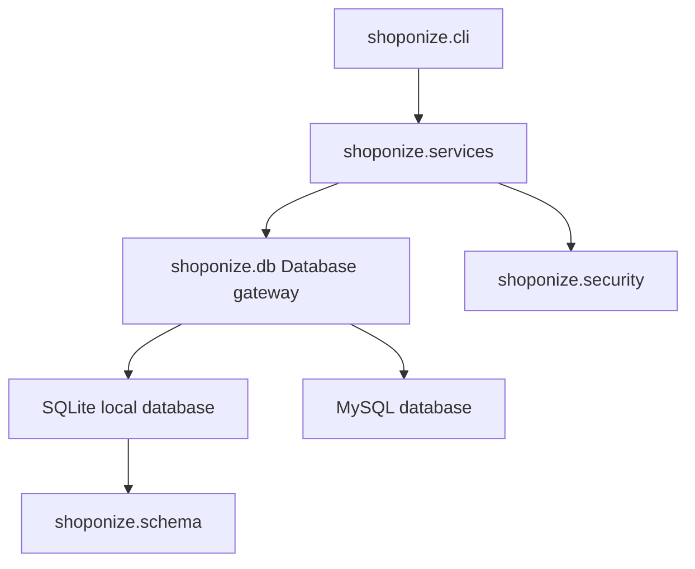

# Shoponize Online Bookstore Management System

A production-minded command-line bookstore system with a clean service layer, relational schema integrity, and automated tests.

This repository now supports:
- SQLite for zero-setup local development and tests.
- MySQL for production-like relational deployment.
- Stronger data integrity and schema constraints.
- Safer business logic for auth, cart, and checkout workflows.
- Test coverage across critical and failure-path flows.

## Table of Contents

1. [Overview](#overview)
2. [Features](#features)
3. [Architecture](#architecture)
4. [Repository Layout](#repository-layout)
5. [Relational Schema](#relational-schema)
6. [Setup](#setup)
7. [Configuration](#configuration)
8. [Usage](#usage)
9. [Testing and Validation](#testing-and-validation)
10. [Troubleshooting](#troubleshooting)
11. [Implementation Notes](#implementation-notes)
12. [Changelog (Overhaul)](#changelog-overhaul)
13. [Residual Risks and Follow-ups](#residual-risks-and-follow-ups)

## Overview

Shoponize models a small online bookstore with customers, admins, suppliers, product catalogs, carts, and orders.

The codebase is layered:
- CLI layer handles interaction.
- Service layer holds business rules.
- Database gateway abstracts backend differences.
- Schema modules define relational storage and seed data.

## Features

| Area | Capabilities |
| --- | --- |
| Authentication | Login by role, failed-attempt tracking, account lockout, account unlock, legacy plaintext and hashed password verification |
| Catalog | Category browsing, product search, detailed product view |
| Cart | Add/update item quantities, stock guardrails, item removal, cart inspection |
| Checkout | Atomic order creation, order line insertion, inventory decrement, low-stock flag update, cart clearing |
| Admin | View/update/delete orders, low-stock visibility, product price updates, customer unlock |
| Data layer | SQLite local mode and MySQL mode with equivalent relational structures |

## Architecture



### Execution Flow

1. `connect.py` launches CLI.
2. `DatabaseConfig.from_env()` resolves backend and connection settings.
3. SQLite mode auto-initializes schema and seed data.
4. CLI calls services for all business actions.
5. Services use one transaction per operation through the DB gateway.

## Repository Layout

```text
.
├── connect.py
├── README.md
├── Shoponize.sql
├── requirements.txt
├── requirements-dev.txt
├── docs/
│   └── relational-schema-review.md
├── shoponize/
│   ├── __init__.py
│   ├── cli.py
│   ├── config.py
│   ├── db.py
│   ├── schema.py
│   ├── security.py
│   └── services.py
└── tests/
    └── test_services.py
```

## Relational Schema

The original screenshot had naming/attribute and consistency issues. A full correction review and final conceptual model are documented in:
- `docs/relational-schema-review.md`

Physical schema implementation is now aligned in:
- `Shoponize.sql` (MySQL)
- `shoponize/schema.py` (SQLite)

### Core Relations

- `customer` 1:1 `customerProfile`
- `customer` 1:N `contactNumber_customer`
- `customer` 1:N `orders`
- `orders` N:M `product` through `contains`
- `customer` N:M `product` through `cart`
- `admin` N:M `productCategory` through `manages`
- `supplier` N:M `product` through `supplies`
- role tables (`customer`, `admin`, `supplier`) each support lockout fields

## Setup

## Prerequisites

| Tool | Version |
| --- | --- |
| Python | 3.9+ |
| SQLite | Included with Python |
| MySQL | Optional for MySQL backend |

## Local Setup (SQLite default)

```bash
python3 -m pip install -r requirements-dev.txt
python3 connect.py
```

On first run, SQLite mode creates and seeds `shoponize.db`.

### Demo Credentials

| Role | Username | Password |
| --- | --- | --- |
| Customer | john_doe | password123 |
| Customer | emily_j | securepass |
| Admin | admin1 | adminpass |

## MySQL Setup

1. Install runtime dependency:

```bash
python3 -m pip install -r requirements.txt
```

2. Create and seed schema:

```bash
mysql -u root -p < Shoponize.sql
```

3. Set environment and run app:

```bash
export SHOPONIZE_DB_BACKEND=mysql
export SHOPONIZE_DB_HOST=127.0.0.1
export SHOPONIZE_DB_PORT=3306
export SHOPONIZE_DB_USER=root
export SHOPONIZE_DB_PASSWORD='your-password'
export SHOPONIZE_DB_NAME=shoponize
python3 connect.py
```

## Configuration

| Variable | Default | Description |
| --- | --- | --- |
| `SHOPONIZE_DB_BACKEND` | `sqlite` | Backend (`sqlite` or `mysql`) |
| `SHOPONIZE_SQLITE_PATH` | `shoponize.db` | SQLite DB file path |
| `SHOPONIZE_DB_HOST` | `127.0.0.1` | MySQL host |
| `SHOPONIZE_DB_PORT` | `3306` | MySQL port |
| `SHOPONIZE_DB_USER` | `root` | MySQL user |
| `SHOPONIZE_DB_PASSWORD` | empty | MySQL password |
| `SHOPONIZE_DB_NAME` | `shoponize` | MySQL database name |

## Usage

Run the app:

```bash
python3 connect.py
```

Main menus:
- Customer mode: search, browse, cart, checkout
- Admin mode: monitor orders, stock, and pricing

## Testing and Validation

### Commands

```bash
python3 -m unittest discover -s tests -v
python3 -m compileall connect.py shoponize tests
```

### Latest Verified Results

- Unit tests: 11 tests, all passing.
- Compile validation: successful listing/compilation of `shoponize` and `tests`.

## Troubleshooting

| Problem | Resolution |
| --- | --- |
| Invalid backend value | Ensure `SHOPONIZE_DB_BACKEND` is `sqlite` or `mysql` |
| MySQL connector error | Install `requirements.txt` |
| MySQL auth/connection error | Verify host/port/user/password/name and that schema was loaded |
| Empty or wrong data in SQLite | Remove `shoponize.db` and rerun app |
| Locked customer account | Login as admin and unlock account |

## Implementation Notes

- Services are backend-neutral and use `?` placeholders. DB gateway rewrites to `%s` for MySQL.
- Checkout is transactional and rollback-safe.
- Status updates are canonicalized and validated against allowed states.
- Checkout total calculation now uses decimal arithmetic to avoid float drift.
- Cart operations now validate positive IDs and explicit customer existence.
- SQLite schema now includes all relationship tables from the corrected relational model.

## Changelog (Overhaul)

| Category | Improvements |
| --- | --- |
| Correctness | Added missing schema tables for SQLite parity, stricter schema checks, canonical status updates |
| Reliability | Improved service-level validation and rollback coverage |
| Maintainability | Kept business logic concentrated in services with explicit helper methods |
| Security | Preserved parameterized SQL everywhere, retained lockout logic and constant-time password checks |
| Data integrity | Added/enforced key constraints and relational coverage across both schema implementations |
| Testability | Expanded suite from 6 to 11 tests including rollback and schema parity checks |
| Documentation | Added full relational model review and expanded README with setup/run/test architecture guidance |

## Residual Risks and Follow-ups

- No end-to-end interactive CLI automation exists yet; tests are service-level.
- MySQL integration is documented and schema-aligned, but was not executed in this environment due no running MySQL server.
- Password migration strategy from legacy plaintext seeds to fully hashed-at-rest records can be implemented in a future migration script.
