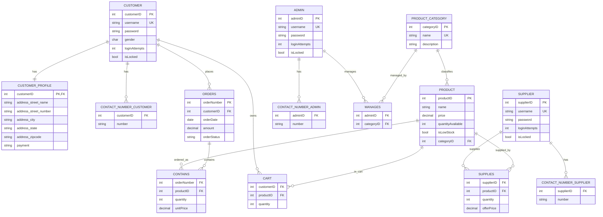

# Relational Schema Review and Corrected Model

## Scope
This review is based on the original image `Screenshot 2024-06-22 162218.png` and the implemented SQL schemas (`Shoponize.sql` and `shoponize/schema.py`).

## Issues Found in the Screenshot

| Area | Problem in Screenshot | Correction Applied |
| --- | --- | --- |
| Naming consistency | Several typos and inconsistent labels (`Relational Schama`, `Adress`, mixed snake/camel, duplicate attributes) | Standardized names in SQL and SQLite schemas (for example `address_state`, `address_zipcode`, `address_street_name`) |
| Attributes | Incorrect/unclear attributes such as `Profile Pie`, `Adress_street_street Name`, and repeated street fields | Replaced with valid profile attributes and removed malformed duplicates |
| Domain constraints | No explicit domain rules shown for key business fields | Added checks for `gender` and `orderStatus` values |
| Relationship completeness | Logical relationships existed visually but local SQLite schema previously omitted some bridge tables | Added `contactNumber_customer`, `contactNumber_admin`, `contactNumber_supplier`, and `manages` to SQLite schema |
| Integrity visibility | Missing explicit cardinality behavior and delete semantics | Enforced referential actions via FK rules (`CASCADE`, `SET NULL`, `RESTRICT`) in physical schemas |

## Corrected Relational Model (Conceptual)

## Physical Schema Alignment Result

The corrected model is now implemented in both:
- `Shoponize.sql` (MySQL)
- `shoponize/schema.py` (SQLite for local/dev tests)

This gives parity between local development and production-like relational behavior.
